# \huge{Práctica 1: Filtrado y Muestreo}
# Ignacio Aguilera Martos
# Visión por Computador

## Ejercicio 1

### Apartado A
**\underline{Enunciado:}**
El cálculo de la convolución de una imagen con una máscara
Gaussiana 2D (Usar GaussianBlur). Mostrar ejemplos con distintos
tamaños de máscara y valores de sigma. Valorar los resultados

**\underline{Solución:}**
Para aplicar la convolución con una máscara Gaussiana 2D en OpenCV nos valemos de la función GaussianBlur que toma como parámetros (los que nos interesan) la imagen, el tamaño de la máscara y la varianza en el eje X y en el eje Y.
Para esta prueba he movido la varianza entre 0 y 5 (en ambos ejes) y el tamaño de la máscara de 3 a 11 haciendo kernels cuadrados y rectangulares.

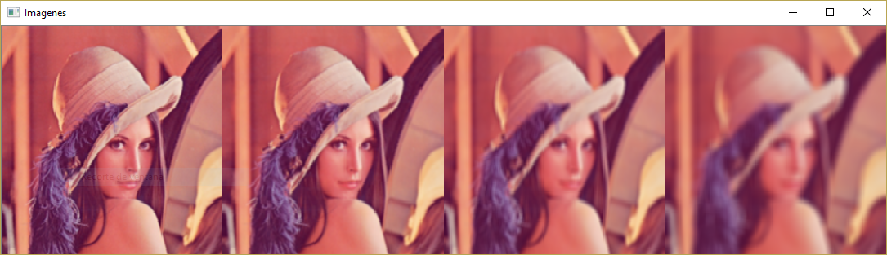

Podemos observar que el efecto se hace más visible de izquierda a derecha. Si nos fijamos en la imagen de la derecha podemos ver que al hacer más grande el tamaño del kernel podemos percibir de forma más nítida los rectángulos o cuadrados en la imagen. Además se observa que al aumentar los valores de sigma el suavizado se hace más visible.

Este operador lo que hace es quedarse con las frecuencias bajas de la imagen reduciendo por tanto el ruido ya que los píxeles toman un valor que viene influenciado por los píxeles aledaños limitando por tanto la posibilidad de que salgan valores extremos o muy distintos a los que engloba la máscara.

### Apartado B
**\underline{Enunciado:}**
Usar getDerivKernels para obtener las máscaras 1D que permiten
calcular al convolución 2D con máscaras de derivadas. Representar
e interpretar dichas máscaras 1D para distintos valores de sigma.

**\underline{Solución:}**
En este caso el ejercicio nos pide que tomemos mediante la función getDerivKernels las máscaras 1-dimensionales que permiten calcular la convolución 2D con máscaras derivadas. Para ello la función getDerivKernels toma como parámetros el orden de la derivada tanto en el eje X como en el Y y el valor de sigma. Observemos el ejemplo para obtener conclusiones:

\vspace{50px}

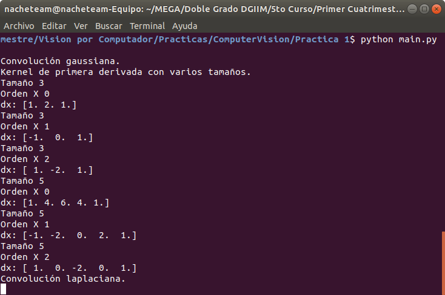

Debemos saber que la función getDerivKernels utiliza por debajo el operador de Sobel para hacer los cálculos cuando el tamaño es mayor que 3x3 (en ese caso se usa Scharr). Interpretemos ahora los vectores obtenidos.

Podemos observar que el orden de la derivada en cada eje nos varía cada uno de los vectores correspondientes. Debemos recordar que este operador (Sobel) es empleado para reconocimiento de bordes en las imágenes, o lo que es lo mismo, un cambio muy notable de color en el entorno de un píxel. La función nos devuelve dos vectores que corresponden a la máscara, ya que es separable.

Nótese que en la imagen sólo se imprime el vector correspondiente a la derivada en el eje X ya que el vector en el eje Y es igual si los parámetros coinciden y así podemos observar todos los ejemplos.

El operador de derivada intenta hacer una aproximación discreta de lo que conocemos o entendemos como derivada, es decir:

$$\lim_{h\rightarrow 0}\frac{f(x+h)-f(x)}{h} = \lim_{h\rightarrow 0}\frac{f(x)-f(x-h)}{h}$$

Como las dos expresiones son iguales podemos sumarlas y dividir por dos para obtener una igualdad equivalente que nos explicará mejor el funcionamiento del operador. El resultado es:

$$\lim_{h\rightarrow 0}\frac{f(x+h)-f(x-h)}{2h}$$

Ahora podemos tener una idea más intuitiva. La idea es que esta definición es para el caso continuo, en nuestro caso la variación h nos indicaría el píxel anterior si estamos restando h o el píxel posterior si la estamos sumando. Con esto realmente lo que estamos haciendo es la resta de los píxeles directamente aledaños a x.

Si observamos las máscaras obtenidas podremos ver que el resultado coincide con la idea. En el primer ejemplo con la derivada de primer orden lo que tenemos es justamente la definición que hemos obtenido de derivada, o lo que es lo mismo el valor de color entre los píxeles aledaños se resta. Esto lo tenemos que visualizar como una matriz, es decir, podemos multiplicar los dos componentes de la máscara (el del eje X y el del eje Y) para obtener una matriz que en el caso dx=1 dy=0 sería:

$$
\begin{bmatrix}
  -1 & 0 & 1 \\
  -2 & 0 & 2 \\
  -1 & 0 & 1
\end{bmatrix}
$$

Esto es muy lógico ya que lo que estamos haciendo es ponderar los píxeles aledaños al centro únicamente en la dirección X y restarlos obteniendo con ello un valor. Cuanto mayor sea el mismo más diferencia tendremos de color entre los píxeles que se encuentran a ambos lados del centro.

Si hiciéramos el operador con dx=0 dy=1 tendríamos la misma matriz pero traspuesta con lo que nos daría la diferencia en el sentido Y.

Si tomamos ahora dx=1=dy lo que vamos a obtener es una diferencia tanto en el sentido de X como en el de Y. Si pensamos en esto como vectores lo que estamos haciendo es derivar con dirección (1,1), veamos la matriz que obtenemos:

$$
\begin{bmatrix}
  1 & 0 & -1 \\
  0 & 0 & 0 \\
  -1 & 0 & 1
\end{bmatrix}
$$

Con esto lo que estamos haciendo es hacer la resta de los valores en las esquinas, o lo que es lo mismo en la dirección (1,1). Con ello lo que obtendremos de valor en el píxel será un borde si la diferencia de los valores de los píxeles en las esquinas es muy grande.

### Apartado C
**\underline{Enunciado:}**
Usar la función Laplacian para el cálculo de la convolución 2D con
una máscara de Laplaciana-de-Gaussiana de tamaño variable.
Mostrar ejemplos de funcionamiento usando dos tipos de bordes y
dos valores de sigma: 1 y 3.

**\underline{Solución:}**
Para aplicar la laplaciana a las imágenes lo primero que tenemos que hacer es aplicar una convolución gaussiana para eliminar el ruido en la imagen. Para ello nos valemos de la función GaussianBlur ya utilizada en el apartado A con un kernel cuadrado y la varianza dada. Aplicamos tras el suavizado el operador laplaciano que consiste en sumar las derivadas de segundo orden de la imagen. Analicemos que obtenemos con esto:

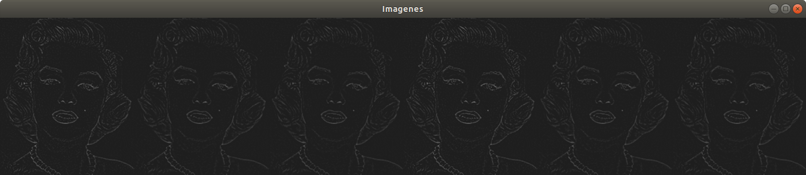
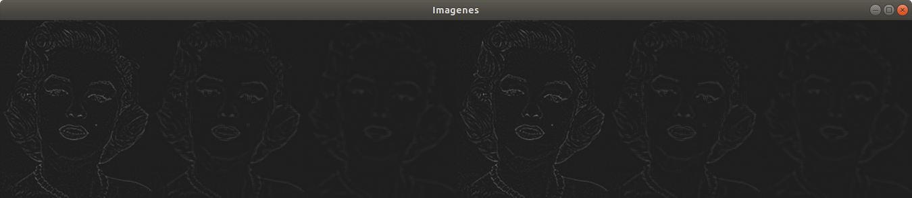

En estos ejemplos podemos ver en la primera imagen el laplaciano aplicado con sigma=1, el tamaño del núcleo tomando valores 3,5,9,3,5,9 y los bordes reflejados y replicados y en la segunda imagen lo mismo pero con sigma=3.

Podemos observar que con sigma=1 la variación entre las imágenes en mínima notando, si acaso, pequeñas variaciones en el cuello y en el hombro. En cambio cuando cambiamos sigma a 3 ya notamos cambios significativos. El hecho de cambiar los bordes no nos ha dado diferencia entre las imágenes pero sí el hecho de variar el tamaño de la máscara. Podemos ver que al aumentar dicho tamaño el suavizado que obtenemos es mayor juntado además con el incremento de sigma por lo que los bordes se suavizan también y obtenemos una peor detección de bordes. Esto viene del hecho de que hemos hecho demasiado suavizado y por tanto hemos perdido información en la imagen.

La detección de bordes del operador lapaciano tiene una idea intuitiva por detrás consistente en que cuando tenemos variaciones notables de color al hacer la segunda derivada vamos a obtener ceros, ya que la primera derivada tendrá un máximo.

## Ejercicio 2

### Apartado A
**\underline{Enunciado:}**
El cálculo de la convolución 2D con una máscara separable de
tamaño variable. Usar bordes reflejados. Mostrar resultados

**\underline{Solución:}**
Esta función implementa la convolución con máscaras separables. Estas máscaras dividen la matriz tradicional que conocemos en las convoluciones en dos vectores: uno fila y otro columna. Este hecho es muy ventajoso puesto que se reduce el orden de complejidad del operador de convolución. Hay que tener en cuenta que para aplicar esta función los vectores pasados como máscara deben estar normalizados.

En los ejemplos generados se aplica en primer lugar una Gaussiana, luego la matriz identidad y por último una máscara de detección de bordes.

La función está implementada a partir de la función sepFilter2D que aplica un filtro separable a una imagen dada.

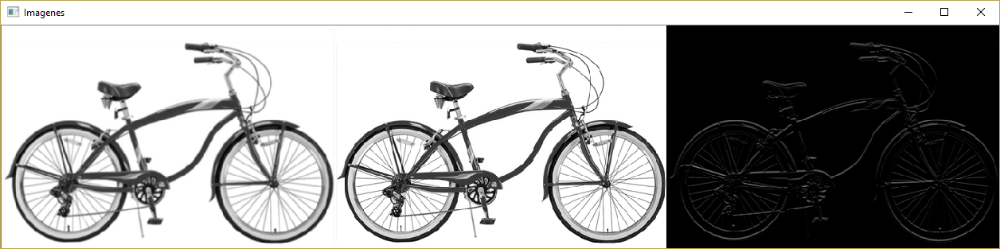

### Apartado B
**\underline{Enunciado:}**
El cálculo de la convolución 2D con una máscara 2D de 1a
derivada de tamaño variable. Mostrar ejemplos de
funcionamiento usando bordes a cero.

**\underline{Solución:}**
En este apartado se nos pide implementar la convolución 2D con una máscara de primera derivada con tamaño variable. Para implementar esto podemos usar getDerivKernels para obtener la máscara separable de la primera derivada en ambos sentidos, es decir, dx=1=dy y tras esto aplicar la máscara separable a la imagen mediante la función sepFilter2D.

Vamos a observar los ejemplos con tamaño variable del kernel, tenemos que tener en cuenta que las imágenes han sido suavizadas previamente:

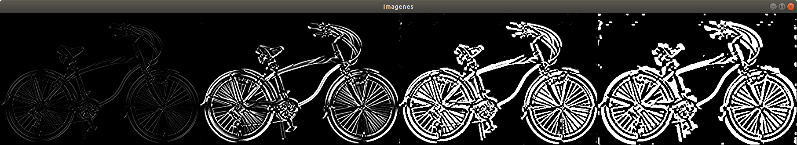

En primer lugar cabe destacar que los tamaños han variado tomando valores 3,5,7 y 11. Podemos observar claramente cómo varía la detección de bordes. Para empezar vemos que en la primera y en la última imagen hay bordes que no son compartidos, como por ejemplo en el borde de la misma. Este fenómeno puede ser explicado fácilmente si pensamos en la repercusión de expandir el tamaño de la máscara. Esta expansión va a provocar que hagamos muchas más sumas al valor del píxel central con  lo que al hacer más sumas el valor obtenido será mucho mayor que si tenemos un tamaño menor, con lo que podemos obtener bordes con más facilidad. El hecho de sumar un valor mayor cuanto más grande es el tamaño de la máscara podemos observarlo de igual modo entre la primera y segunda imágenes en las que no apreciamos una diferencia esencial de bordes pero por contra si vemos que los bordes se muestran mucho más blancos en la segunda imagen (con tamaño mayor de máscara) que en la primera. Así mismo al aumentar el tamaño de la máscara es más probable obtener unos bordes mucho más grandes ya que los píxeles aledaños al borde real serán tomados también como tal ya que un extremo del kernel puede caer en un lado del borde y el otro extremo en el lado contrario.

Como conclusión podemos decir que si ponemos un tamaño pequeño obtendremos los bordes más significativos o con una diferencia de colores mayor y si tomamos un tamaño más grande de máscara obtendremos hasta los bordes más sutiles de forma gradiente si nos alejamos de ellos.

### Apartado C
**\underline{Enunciado:}**
El cálculo de la convolución 2D con una máscara 2D de 2a
derivada de tamaño variable.

**\underline{Solución:}**
Para implementar la máscara de segunda derivada empleamos las mismas funciones que en el segundo apartado, pero tomando ahora dx=2=dy y aplicando sepFilter2D y aplicando un suavizado a la imagen para reducir el ruido. Veamos los ejemplos para explicarlos:

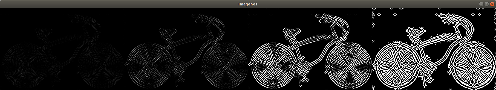

Los ejemplos han sido obtenidos con tamaños de máscara variando entre 3,5,7 y 11.

Para comenzar el análisis hay que tener en cuenta que derivamos en la dirección (2,2) o lo que es lo mismo $2\cdot (1,1)$, es decir, esencialmente derivamos en la misma dirección que en el apartado anterior pero con mayor 'intensidad'. Esto es claramente visible cuando miramos la primera y segunda imagen. Podemos apreciar que los bordes más resaltados son los que van en la misma dirección de la derivación como se puede apreciar en las ruedas de la bicicleta o en el cuadro de la misma que son los bordes más resaltados. Así mismo podemos percibir como en el apartado anterior que cuando mayor es el tamaño de la máscara los bordes que se obtienen son más gruesos y más imprecisos.

### Apartado D
**\underline{Enunciado:}**
Una función que genere una representación en pirámide
Gaussiana de 4 niveles de una imagen. Mostrar ejemplos de
funcionamiento usando bordes

**\underline{Solución:}**
En este apartado el objetivo era implementar una pirámide gaussiana, es decir, una secuencia de imágenes en la cual primero se aplica un suavizado gaussiano y después se hace un subsampling para obtener una imagen de menor tamaño. En el enunciado no se especificaban los bordes a usar, por lo que he tomado bordes constantes.

Para implementar la función he utilizado la función pyrDown que se encarga tanto del suavizado como del downsampling como se especifica en la documentación de OpenCV. Esto se repite hasta obtener los 4 niveles pedidos por defecto.

Veamos un ejemplo para observar que el resultado obtenido es el esperable:

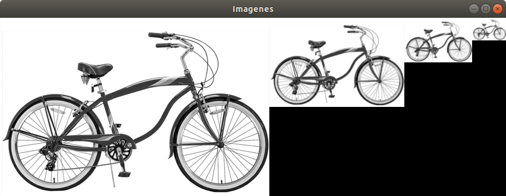

\vspace{30px}

### Apartado E
**\underline{Enunciado:}**
Una función que genere una representación en pirámide
Laplaciana de 4 niveles de una imagen. Mostrar ejemplos de
funcionamiento usando bordes.

**\underline{Solución:}**
En este ejercicio se nos pide que implementemos la pirámide laplaciana. Esta pirámide se basa en la gaussiana por lo que nos valemos de la función implementada en el apartado anterior para implementar este.

El mecanismo de construcción de la pirámide laplaciana consiste en tomar la imagen i+1-ésima de la pirámide gaussiana, realizarle un upsample para igualarla en tamaño a la i-ésima y restarlas entre sí. Esto nos va a dar algo parecido a lo que obtendríamos con una máscara de detección de bordes. Tenemos que tener en cuenta que haciendo esto la última imagen de la pirámide no podemos hallarla con una pirámide gaussiana del mismo número de niveles, por lo que tendremos que generar una tamaño uno más que el de la pirámide laplaciana.

Para comprobar el resultado obtenido veamos el ejemplo:

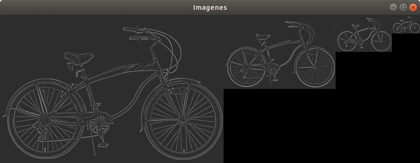

Hay que tener en cuenta que por motivos puramente estéticos para observar bien los cambios en la imagen he sumado una constante (45) a cada píxel de la imagen con lo que el fondo en vez de ser negro es de un tono gris claro.

## Ejercicio 3
**\underline{Enunciado:}**

1. Escribir una función que muestre las tres imágenes ( alta, baja e híbrida) en una misma ventana. (Recordar que las imágenes después de una convolución contienen número flotantes que pueden ser positivos y negativos)

2. Realizar la composición con al menos 3 de las parejas de imágenes

**\underline{Solución:}**
En este ejercicio se nos pide implementar la idea estudiada en el paper de Oliva, Torralba y Schyns. La idea detrás de las imágenes híbridas consiste en dividir una imagen en dos: la que contiene las frecuencias altas y las frecuencias bajas de tal forma que si nos alejamos lo suficiente de la imagen veamos las frecuencias bajas y si nos acercamos veamos las frecuencias altas.

Para conseguir las imágenes correspondientes aplicamos el siguiente proceso: primero hacemos un suavizado a la imagen para obtener la imagen que contiene las frecuencias bajas y después restamos esta a la original para obtener las frecuencias altas. Con ello sólo nos queda sumar las dos imágenes obtenidas para obtener la híbrida.

Para este ejercicio he tomado tres parejas como el enunciado pedía: un pájaro y un avión, un submarino y un pez y una bicicleta y una moto. Los parámetros han sido ajustados a mano para intentar obtener la mejor vista posible de la imagen híbrida. A continuación se muestran los resultados:

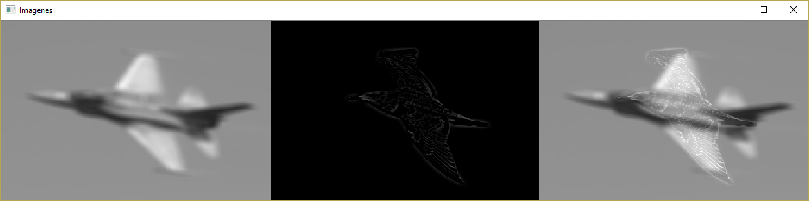
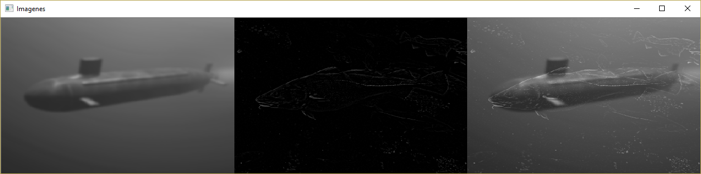
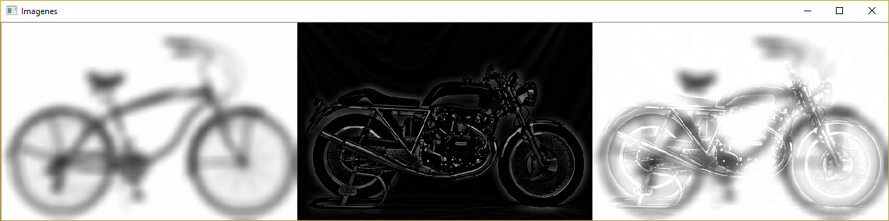

Cabe destacar que no sólo es importante escoger el tamaño de la máscara y sigma de forma adecuada si no también hacer la elección correcta de que imagen tomar las frecuencias altas y de cuál las bajas.
