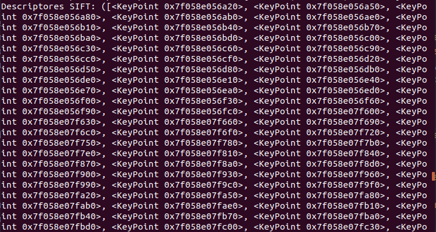
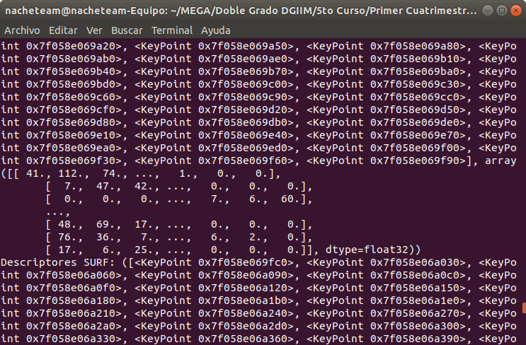

# \huge{Práctica 2: Detección de puntos relevantes y construcción de panoramas}
# Ignacio Aguilera Martos
# Visión por Computador

## Ejercicio 1
Detección de puntos SIFT y SURF. Aplicar la detección de puntos SIFT y SURF sobre las imágenes, representar dichos puntos sobre las imágenes haciendo uso de la función drawKeypoints. Presentar los resultados con las imágenes Yosemite.rar.

### Apartado A
**\underline{Enunciado:}**
Variar los valores de umbral de la función de detección de puntos hasta obtener un conjunto numeroro ($\geq$ 1000) de puntos SIFT y SURF que sea representativo de la imágen. Justificar la elección de los parámetros en relación a la representatividad de los puntos obtenidos.

**\underline{Solución:}**
Para la elección de los puntos SIFT he usado los valores nfeatures=0, nOctaveLayers=3, contrastThreshold=0.06, edgeThreshold=6 y sigma=1.6.

Los valores que he empleado para SURF y Yosemite1 los valores nfeatures, nOctaveLayers y sigma no los he variado de los que venían por defecto. En cambio contrastThreshold y edgeThreshold los he modificado para obtener menos puntos dentro de la imagen. Al iniciar el algoritmo con los valores que venían por defecto he podido observar que el número de puntos que obtenían los algoritmos era muy elevado pero muy concentrados en ciertas zonas de la imagen y con puntos en zonas negras o el cielo. He modificado contrastThreshold aumentándolo puesto que cuanto mayor sea este número menos elementos filtramos y he modificado edgeThreshold para que obtuviera menos puntos en los bordes de las figuras, puesto que estaban muy saturados.

Los puntos que he obtenido han sido:

En la detección de los puntos SURF he modificado únicamente el parámetro hessianThreshold. Los puntos que SURF obtiene tienen que tener una hessiana mayor que este valor, por lo que si lo vamos aumentando se obtienen menos puntos clave en la imagen. El valor que he tomado para este parámetro ha sido 400. Al inicio, al igual que con SIFT, obtuve muchos puntos en la imagen que estaban colocados en zonas negras y el cielo, fui aumentando el valor de umbral hasta que conseguí que estos puntos no estuvieran y hubiese un conjunto de al menos 1000 puntos.

Los puntos que he obtenido han sido:

Para la imagen Yosemite2 he utilizado en SIFT los valores contrastThreshold a 0.06 y edgeThreshold a 4, puesto que detectaba muchos puntos en los bordes de las nubes.

Los resultados obtenidos para SIFT han sido:

Para la imagen Yosemite2  he utilizado en SURF un valor de hessianThreshold de 500, ya que al igual que con SIFT se obtenían muchos puntos en las nubes que posteriormente no iban a ser relevantes por la gran concrentración de los mismos.

### Apartado B
**\underline{Enunciado:}**
Identificar cuántos  puntos se han detectado dentro de cada octava. En el caso de SIFT, identificar también los puntos detectados en cada capa. Mostrar el resultado dibujando sobre la imagen original un círculo centrado en cada punto y de radio proporcional al valor de sigma usado para su detección (ver circle()) y pintar cada octava en un color.

**\underline{Solución:}**

Lo primero que hay que hacer para poder obtener las octavas y capas es extraer la información de los KeyPoints. Los KeyPoints, por eficiencia, tienen gran parte de la información (incluídas la escala y octava) en un sólo número entero. Para poder obtener esta información es necesario, para la octava, aplicar una máscara al número, en concreto la que viene dada por 0xFF o 255. Para poder obtener la información de la capa tenemos que hacer un shift binario de desplazamiento 8.

Una vez que tenemos la información anterior extraída es sencillo poder contar los puntos en cada octava y capa (sólo para SIFT). Como hemos visto en teoría, se aplica un subsampling a la imagen y un blur reduciendo la resolución a la mitad cada vez que se hace esta operación, cuyo resultado es conocido como octava. En cada octava se realiza un algoritmo de detección, por lo que podemos saber de que octava proviene cada punto. Además en el algoritmo SIFT se le aplica un suavizado Gaussiano por capas (en cada capa el suavizado es mayor que en la anterior) para cada octava, de forma que no sólo podemos obtener de qué octava proviene un punto de interés si no que también podemos saber de qué capa proviene.

Como se puede observar la información obtenida se representa en un diccionario de Python, en el que el identificador es la octava o capa correspondiente y el valor es el número de puntos obtenidos en dicha capa u octava.

Como podemos observar la detección de puntos de interés es más efectiva en la primera octava de SIFT y SURF y en las primeras capas de SIFT. Esto es razonable, puesto que cuanto más suavizado y subsampling apliquemos más restringimos los valores de los píxeles destacados. Aún así la detección en octavas y capas mayores a la primera sigue siendo útil.

Para poder visualizar mejor los puntos de interés obtenidos tal y como se dice en el enunciado, puede ser de interés pintar los puntos por colores en función de sus octavas y pintar los puntos como círculos cuyo radio sea proporcional al sigma usado para hallarlo, de forma que podemos ver el nivel de suavizado que se ha requerido para llegar al mismo. Veamos las imagenes para SIFT:

Como podemos observar hay un punto en concreto que destaca por el gran radio de su círculo, esto es debido a que pertenece a una de las capas más profundas de SIFT, de forma que se ha aplicado un suavizado muy grande hasta llegar a el. Cabe destacar que los colores empleados para pintar las octavas han sido (según el orden): amarillo, rojo, naranja, verde, verde azulado y azul claro. De esta forma los puntos de la primera octava se pintan en amarillo y los de la última en azul claro.

Se puede observar en el caso de SURF que se comparten puntos con SIFT en los que se ha aplicado un suavizado muy grande hasta detectarlos como puntos de interés.

### Apartado C
**\underline{Enunciado:}**
Mostrar cómo con el vector de keyPoint extraídos se pueden calcular los descriptores SIFT y SURF asociados a cada punto usando OpenCV.

**\underline{Solución:}**
Para poder calcular los descriptores utilizando ya los keyPoints calculados en los apartados anteriores OpenCV tiene la función 'compute'.

La función compute es válida tanto para objetos SIFT como SURF, de forma que dados los keyPoints y la imagen se pueden obtener los descriptores asignados a dichos puntos de interés.

Aquí podemos ver la salida de los keyPoints para SIFT:

OpenCV también ofrece un método que calcula los descriptores y los puntos de interés en una sola orden: detectAndCompute. Esta orden funciona igual que la detección de puntos de interés, con la única diferencia de que devuelve dos objetos: los puntos de interés y los descriptores.
