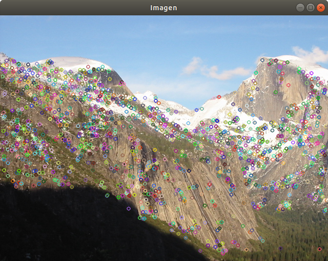
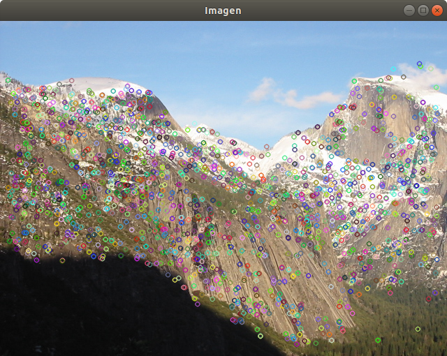

# \huge{Práctica 2: Detección de puntos relevantes y construcción de panoramas}
# Ignacio Aguilera Martos
# Visión por Computador

## Ejercicio 1
Detección de puntos SIFT y SURF. Aplicar la detección de puntos SIFT y SURF sobre las imágenes, representar dichos puntos sobre las imágenes haciendo uso de la función drawKeypoints. Presentar los resultados con las imágenes Yosemite.rar.

### Apartado A
**\underline{Enunciado:}**
Variar los valores de umbral de la función de detección de puntos hasta obtener un conjunto numeroro ($\geq$ 1000) de puntos SIFT y SURF que sea representativo de la imágen. Justificar la elección de los parámetros en relación a la representatividad de los puntos obtenidos.

**\underline{Solución:}**
Para la elección de los puntos SIFT he usado los valores nfeatures=0, nOctaveLayers=3, contrastThreshold=0.06, edgeThreshold=6 y sigma=1.6.

Los valores que he empleado para SURF en nfeatures, nOctaveLayers y sigma no los he variado de los que venían por defecto. En cambio contrastThreshold y edgeThreshold los he modificado para obtener menos puntos dentro de la imagen. Al iniciar el algoritmo con los valores que venían por defecto he podido observar que el número de puntos que obtenían los algoritmos era muy elevado pero muy concentrados en ciertas zonas de la imagen y con puntos en zonas negras o el cielo. He modificado contrastThreshold aumentándolo puesto que cuanto mayor sea este número menos elementos filtramos y he modificado edgeThreshold para que obtuviera menos puntos en los bordes de las figuras, puesto que estaban muy saturados.

Los puntos que he obtenido han sido:

En la detección de los puntos SURF he modificado únicamente el parámetro hessianThreshold. Los puntos que SURF obtiene tienen que tener una hessiana mayor que este valor, por lo que si lo vamos aumentando se obtienen menos puntos clave en la imagen. El valor que he tomado para este parámetro ha sido 400. Al inicio, al igual que con SIFT, obtuve muchos puntos en la imagen que estaban colocados en zonas negras y el cielo, fui aumentando el valor de umbral hasta que conseguí que estos puntos no estuvieran y hubiese un conjunto de al menos 1000 puntos.

Los puntos que he obtenido han sido:

### Apartado B
**\underline{Enunciado:}**
Identificar cuántos  puntos se han detectado dentro de cada octava. En el caso de SIFT, identificar también los puntos detectados en cada capa. Mostrar el resultado dibujando sobre la imagen original un círculo centrado en cada punto y de radio proporcional al valor de sigma usado para su detección (ver circle()) y pintar cada octava en un color.

**\underline{Solución:}**

Lo primero que hay que hacer para poder obtener las octavas y capas es extraer la información de los KeyPoints. Los KeyPoints, por eficiencia, tienen gran parte de la información (incluídas la escala y octava) en un sólo número entero. Para poder obtener esta información es necesario, para la octava, aplicar una máscara al número, en concreto la que viene dada por 0xFF o 255. Para poder obtener la información de la capa tenemos que hacer un shift binario de desplazamiento 8.

Una vez que tenemos la información anterior extraída es sencillo poder contar los puntos en cada octava y capa (sólo para SIFT). Como hemos visto en teoría, se aplica un subsampling a la imagen y un blur reduciendo la resolución a la mitad cada vez que se hace esta operación, cuyo resultado es conocido como octava. 
