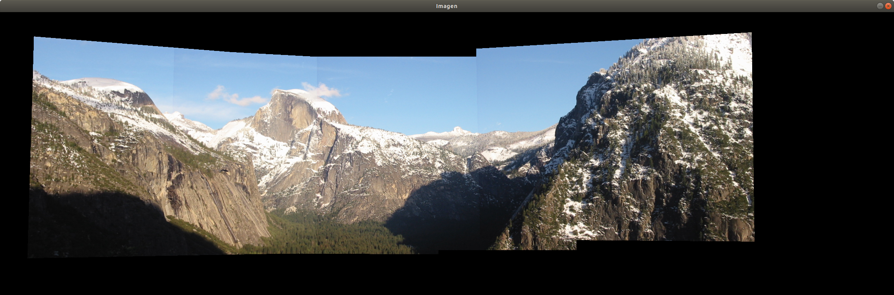

# \huge{Práctica 2: Detección de puntos relevantes y construcción de panoramas}
# Ignacio Aguilera Martos
# Visión por Computador

## Ejercicio 1
Detección de puntos SIFT y SURF. Aplicar la detección de puntos SIFT y SURF sobre las imágenes, representar dichos puntos sobre las imágenes haciendo uso de la función drawKeypoints. Presentar los resultados con las imágenes Yosemite.rar.

### Apartado A
**\underline{Enunciado:}**
Variar los valores de umbral de la función de detección de puntos hasta obtener un conjunto numeroro ($\geq$ 1000) de puntos SIFT y SURF que sea representativo de la imágen. Justificar la elección de los parámetros en relación a la representatividad de los puntos obtenidos.

**\underline{Solución:}**
Para la elección de los puntos SIFT he usado los valores nfeatures=0, nOctaveLayers=3, contrastThreshold=0.06, edgeThreshold=6 y sigma=1.6.

Para valores que he empleado en SIFT y Yosemite1 en nfeatures, nOctaveLayers y sigma no los he variado de los que venían por defecto. En cambio contrastThreshold y edgeThreshold los he modificado para obtener menos puntos dentro de la imagen. Al iniciar el algoritmo con los valores que venían por defecto he podido observar que el número de puntos que obtenían los mismos era muy elevado pero muy concentrados en ciertas zonas de la imagen y con puntos en zonas negras o el cielo. He modificado contrastThreshold aumentándolo puesto que cuanto mayor sea este número menos elementos filtramos y he modificado edgeThreshold para que obtuviera menos puntos en los bordes de las figuras, puesto que estaban muy saturados.

Los puntos que he obtenido han sido:

\newpage
{ width=75% height=75% }

En la detección de los puntos SURF he modificado únicamente el parámetro hessianThreshold. Los puntos que SURF obtiene tienen que tener una hessiana mayor que este valor, por lo que si lo vamos aumentando se obtienen menos puntos de interés en la imagen. El valor que he tomado para este parámetro ha sido 400. Al inicio, al igual que con SIFT, obtuve muchos puntos en la imagen que estaban colocados en zonas negras y el cielo, fui aumentando el valor de umbral hasta que conseguí que estos puntos no estuvieran y hubiese un conjunto de al menos 1000 puntos.

Los puntos que he obtenido han sido:

\newpage
{ width=75% height=75% }

Para la imagen Yosemite2 he utilizado en SIFT los valores contrastThreshold a 0.06 y edgeThreshold a 4, puesto que detectaba muchos puntos en los bordes de las nubes.

Los resultados obtenidos para SIFT han sido:

\newpage
{ width=75% height=75% }

Para la imagen Yosemite2  he utilizado en SURF un valor de hessianThreshold de 500, ya que al igual que con SIFT se obtenían muchos puntos en las nubes que posteriormente no iban a ser relevantes por la gran concrentración de los mismos.

\newpage
{ width=75% height=75% }

### Apartado B
**\underline{Enunciado:}**
Identificar cuántos  puntos se han detectado dentro de cada octava. En el caso de SIFT, identificar también los puntos detectados en cada capa. Mostrar el resultado dibujando sobre la imagen original un círculo centrado en cada punto y de radio proporcional al valor de sigma usado para su detección (ver circle()) y pintar cada octava en un color.

**\underline{Solución:}**

Lo primero que hay que hacer para poder obtener las octavas y capas es extraer la información de los KeyPoints. Los KeyPoints, por eficiencia, tienen gran parte de la información (incluídas la escala y octava) en un sólo número entero. Para poder obtener esta información es necesario, para la octava, aplicar una máscara al número, en concreto la que viene dada por 0xFF o 255. Para poder obtener la información de la capa tenemos que hacer un shift binario de desplazamiento 8. En mi caso en concreto he modificado convenientemente el número de octava para que empiece desde el 0 en adelante.

Una vez que tenemos la información anterior extraída es sencillo poder contar los puntos en cada octava y capa (sólo para SIFT). Como hemos visto en teoría, se aplica un subsampling a la imagen y un blur reduciendo la resolución a la mitad cada vez que se hace esta operación, cuyo resultado es conocido como octava. En cada octava se realiza un algoritmo de detección, por lo que podemos saber de que octava proviene cada punto. Además en el algoritmo SIFT se le aplica un suavizado Gaussiano por capas (en cada capa el suavizado es mayor que en la anterior) para cada octava, de forma que no sólo podemos obtener de qué octava proviene un punto de interés si no que también podemos saber de qué capa proviene.

Como se puede observar la información obtenida se representa en un diccionario de Python, en el que el identificador es la octava o capa correspondiente y el valor es el número de puntos obtenidos en dicha capa u octava.

Como podemos observar la detección de puntos de interés es más efectiva en la primera octava de SIFT y SURF y en las primeras capas de SIFT. Esto es razonable, puesto que cuanto más suavizado y subsampling apliquemos más restringimos los valores de los píxeles destacados. Aún así la detección en octavas y capas mayores a la primera sigue siendo útil.

Para poder visualizar mejor los puntos de interés obtenidos tal y como se dice en el enunciado, puede ser de interés pintar los puntos por colores en función de sus octavas y pintar los puntos como círculos cuyo radio sea proporcional al sigma usado para hallarlo, de forma que podemos ver el nivel de suavizado que se ha requerido para llegar al mismo. Veamos las imagenes para SIFT:

\newpage
{ width=55% height=55% }

{ width=55% height=55% }

\newpage
Como podemos observar hay un punto en concreto que destaca por el gran radio de su círculo, esto es debido a que pertenece a una de las capas más profundas de SIFT, de forma que se ha aplicado un suavizado muy grande hasta llegar a el. Cabe destacar que los colores empleados para pintar las octavas han sido (según el orden): amarillo, rojo, naranja, verde, verde azulado y azul claro. De esta forma los puntos de la primera octava se pintan en amarillo y los de la última en azul claro.

{ width=55% height=55% }

{ width=55% height=55% }

Se puede observar en el caso de SURF que se comparten puntos con SIFT en los que se ha aplicado un suavizado muy grande hasta detectarlos como puntos de interés.

### Apartado C
**\underline{Enunciado:}**
Mostrar cómo con el vector de keyPoint extraídos se pueden calcular los descriptores SIFT y SURF asociados a cada punto usando OpenCV.

**\underline{Solución:}**
Para poder calcular los descriptores utilizando ya los keyPoints calculados en los apartados anteriores OpenCV tiene la función 'compute'.

La función compute es válida tanto para objetos SIFT como SURF, de forma que dados los keyPoints y la imagen se pueden obtener los descriptores asignados a dichos puntos de interés.

Aquí podemos ver la salida de los keyPoints para SIFT y SURF sobre Yosemite1 y Yosemite2:

{ width=50% height=50% }

{ width=50% height=50% }

\newpage

{ width=50% height=50% }

{ width=50% height=50% }

\newpage

{ width=50% height=50% }

{ width=50% height=50% }

Podemos ver que en el formato de OpenCV se devuelve en primer lugar el vector de KeyPoints y en segundo lugar los descriptores, por lo que lo interesante en este caso es la matriz que se encuentra en último lugar.

OpenCV también ofrece un método que calcula los descriptores y los puntos de interés en una sola orden: detectAndCompute. Esta orden funciona igual que la detección de puntos de interés, con la única diferencia de que calcula en un sólo paso los dos objetos: los puntos de interés y los descriptores.

## Ejercicio 2
Usar el detector-descriptor SIFT de OpenCV sobre las imágenes de Yosemite.rar (cv2.xfeatures2d.SIFT_create()). Extraer sus listas de keyPoints y descriptores asociados. Establecer las correspondencias existentes entre ellos usando el objeto BFMatcher de OpenCV  y los criterios de correspondencias "BruteForce+crossCheck" y "Lowe-Average-2NN". (NOTA: Si se usan los resultados propios del punto anterior en lugar del cálculo de SIFT de OpenCV se añaden 0.5 puntos).

### Apartado A
**\underline{Enunciado:}**
Mostrar ambas imágenes en un mismo canvas y pintar líneas de diferentes colores entre las coordenadas de los puntos en correspondencias. Mostrar en cada caso 100 elegidas aleatoriamente.

**\underline{Solución:}**
Para la detección de correspondencias con fuerza bruta y cross check tenemos que crear, tal y como dice el enunciado un objeto BFMatcher. En nuestro caso para el CrossCheck tenemos que ponerle como parámetros la norma que debe emplear, usando la norma L2 (también conocida como euclídea) que es la que se emplea por defecto además de un booleano llamado crossCheck que debemos colocar a True. Tras esto se comprueban las correspondencias mediante la función match de OpenCV y tomamos una muestra de 100 elementos sin reemplazamiento, es decir, sin repetir elementos. Tras esto sólo tenemos que llamar a la función drawMatches con la muestra que hemos obtenido y obtenemos la imagen de las correspondencias.

A continuación vemos el resultado:

Como podemos observar las correspondencias de los puntos que no comparten las imágenes es bastante pobre, haciendo que haya muchas líneas cruzadas entre sí yendo a puntos que no se corresponden visualmente entre imágenes. Aún así los puntos que sí tienen una correspondencia visual clara entre ambas imágenes si se pegan de forma conveniente.

Para la detección de correspondencias Lowe-Average-2NN tenemos que aplicar los criterios que Lowe define en su paper. Debemos buscar las correspondencias esta vez con el crossCheck a False y con la función knnMatch que nos busca las correspondencias usando los dos puntos más cercanos, es decir con 2NN. Tras esto tenemos que aplicar el test definido por Lowe en el que sólo nos quedamos con puntos que disten poco entre sí, es decir que las correspondencias entre las imágenes sean cercanas con la intención de poder hacer un pegado de las mismas de buena calidad. Tras esta selección de Lowe tomamos la muestra de 100 puntos de la imagen al igual que en el caso anterior y obtenemos la imagen con las correspondencias.

Como podemos ver esta vez los puntos muy distantes entre las imágenes no han pasado el test de Lowe, de forma que sólo tenemos correspondencias cercanas al colocar las dos imágenes juntas. Si nos paramos a observar el test lo que estamos es comparando la distancia obtenida de los dos vecinos al punto, es decir, distancias de dos correspondencias muy distantes serán rechazadas ya que tienen menos cohesión, al hacer esto es mucho más fácil que las correspondencias que obtengamos sean muy ajustadas a lo que percibimos visualmente, cosa evidente al comparar zonas muy similares de las imágenes.

Hay que tener en cuenta que el número por el que multiplicamos (en este caso 0.8) puede ser ajustado para obtener los mejores resultados, en mi caso he tomado 0.8 ya que es el que Lowe toma en su paper.

Si comparamos los dos métodos podemos ver que en el primero obtenemos puntos repartidos por toda la imagen, de forma que hay muchas líneas cruzadas, ya que al ser puntos muy distantes entre sí no vamos a encontrar una correspondencia. Por ejemplo, si tomamos la imagen generada, podemos ver que en la montaña de la izquierda hay varios puntos de interés marcados. Estos puntos no tienen una correspondencia real en la imagen de al lado, puesto que dicha parte de la primera imagen no se encuentra en la segunda. Aquí es donde el test de Lowe nos da una gran mejora con respecto a la fuerza bruta.

## Ejercicio 3
Escribir una función que genere un mosaico de calidad a partir de N=3 imágenes relacionadas por homografías, sus listas de keyPoints calculados de acuerdo al punto anterior y las correspondencias encontradas entre dichas listas. Estimar las homografías entre ellas usando la función cv2.findHomography(p1,p2,CV_RANSAC,1). Para el mosaico será necesario.

a) Definir una imagen en la que pintaremos el mosaico.

b) Definir la homografía que lleva cada una de las imágenes a la imagen del mosaico.

c) Usar la función cv2.warpPerspective() para trasladar cada imagen al mosaico (Ayuda: Usar el flag BORDER_TRANSPARENT de warpPerspective).

**\underline{Solución:}**
Antes de abarcar la pregunta 4 y hacer la función para el caso general he realizado el caso de tres imágenes a mano, tal y como se pide en el tercer ejercicio. Hay que tener en cuenta que al componer las homografías y al obtenerlas el orden cuenta y es muy relevante, ya que podemos obtener muchos cortes en la imagen resultado por no hacer las homografías en el orden correcto como ahora discutiré.

Para el caso de tres imágenes comenzamos calculando los puntos de interés y descriptores de las tres imágenes y calculamos las coincidencias con Lowe Average 2NN para calcular la homografía de la primera con la segunda. Empleamos el test de Lowe debido a que los resultados obtenidos tienen una calidad mucho mayor que fuerza bruta y cross check. Para la segunda imagen y la tercera tenemos que tener en cuenta que el cálculo de la homografía debe ser al revés, en otro caso nos quedaría un corte notable en la imagen resultado. Ahora tenemos que pensar cómo trasladamos la imagen central hacia la imagen resultado donde uniremos con las dos homografías calculadas.

Para la imagen central debemos hacer una traslación con una matriz de la forma:
$$
\begin{pmatrix}
1 & 0 & x \\
0 & 1 & y \\
0 & 0 & 1
\end{pmatrix}
$$

donde x es la coordenada en el eje x a la que queremos trasladar la imagen central e y es la cordenada en el eje y a la que queremos trasladar la imagen central. De esta forma obtenemos tres homografías: la que nos pega la primera imagen con la segunda, la traslación de la imagen central a la imagen resultado y la homografía que nos pega la tercera imagen con la segunda. Además cabe decir que el punto (x,y) al que queremos trasladar nuestra imagen central es el punto medio de la imagen resultado menos la mitad de la dimensión de la imagen central. Esto lo debemos hacer así para que la imagen nos quede centrada, ya que la traslación nos lleva la esquina superior izquierda al punto (x,y), si la trasladasemos justo al centro de la imagen resultado la imagen no nos quedaría centrada.

Veamos los resultados obtenidos con las imagenes Yosemite1, Yosemite2 y Yosemite3:

\newpage

## Ejercicio 4
Lo mismo que en el punto anterior pero para $N>5$ (usar las imágenes para mosaico).

**\underline{Solución:}**
Una vez realizado el ejercicio para tres imágenes únicamente debemos tener en cuenta varias cosas:

- Si tenemos un número impar de imagenes tenemos localizado claramente el centro de dicho vector, pero en el caso de un número par estará desplazado hacia uno de los lados ya que no hay un centro.

- El orden de las homografías influye en el resultado final, si estamos en la mitad izquierda las homografías van de izquierda a derecha, es decir la imagen 0 con la imagen 1, la 1 con la 2, etc. En el caso de la parte derecha del vector de imágenes las homografías deben ir a la inversa, es decir, la imagen N-ésima con la (N-1)-ésima, la (N-1)-ésima con la (N-2)-ésima, etc.

- Ahora al tener un número mayor de imágenes vamos a tener que realizar composición de homografías (no sólo con la traslación). Tenemos que tener en cuenta que la primera imagen de todas tendrá que tener una homografía que sea composición de todas las que hay a su derecha (incluida la traslación) más la suya, que es la que pega la imagen 1 con la 2. De igual forma para el resto de imágenes y para el lado derecho del vector de imágenes.

Tras estas consideraciones la implementación de la función no supone mucha dificultad. En primer lugar obtenemos las homografías en el orden correcto que pegan las imágenes entre sí como especifico en el segundo punto. Después calculamos la composición de forma conveniente como se especifica en el tercer punto y por último obtenemos un vector en el que tengamos para cada posición la homografía correspondiente para cada imagen. De esta foma el último paso, que es aplicar la función warpPerspective se hace de forma sencilla recorriendo el vector en orden y aplicando las homografías en orden, incluyendo la traslación que estará en la posición central para que la imagen central se traslade al centro de la imagen resultado.

Veamos los resultados para Yosemite1, Yosemite2 y Yosemite3 para comparar con el ejercicio anterior:

Como podemos observar el resultado es exactamente el mismo que en el ejercicio anterior, ya que el funcionamiento es el mismo.

Veamos que se obtiene una buena superposición también con un número par de imágenes Yosemite 1 a Yosemite 4:

Por último veamos que cuando no tenemos todas las imágenes alineadas de izquierda a derecha también obtenemos una buena superposición, como ocurre con las imágenes de mosaico de la ETSIIT:

